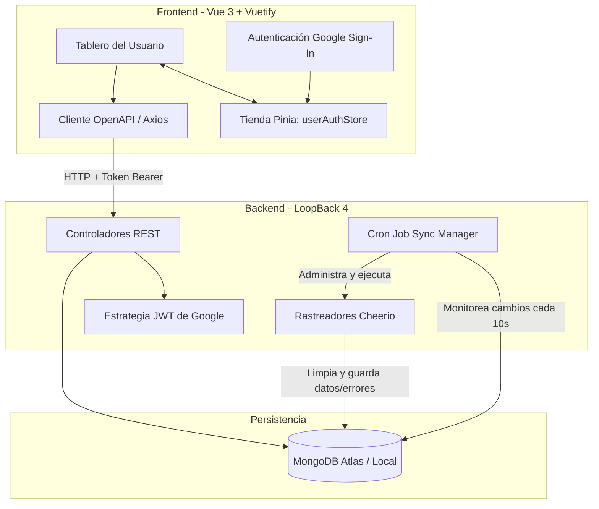

# Web-Scraping Portal

Un portal web de scraping automatizado y multi-inquilino (multi-tenant) desarrollado con una arquitectura desacoplada que consta de un cliente en **Vue 3** y un servidor API en **LoopBack 4** respaldado por **MongoDB**.

El sistema permite a los usuarios autenticarse con su cuenta de Google, configurar múltiples sitios web para monitorear, definir expresiones personalizadas en JavaScript (utilizando Cheerio) para extraer datos de las páginas y programar ejecuciones periódicas automáticas mediante tareas cron integradas.

---

## 🏗️ Arquitectura General

El proyecto se divide en dos partes principales:

1. **Frontend (`/Frontend`)**: Una aplicación cliente reactiva tipo SPA (Single Page Application) construida con **Vue 3**, **Vite**, **Vuetify** (diseño y componentes de interfaz de usuario) y **Pinia** (gestión del estado).
2. **Backend (`/Backend`)**: Un servidor de API REST empresarial construido sobre **LoopBack 4** (Node.js/TypeScript) conectado a **MongoDB**, que gestiona la autenticación mediante tokens de Google JWT y cuenta con un planificador de tareas cron dinámico.

### Diagrama de Flujo y Componentes



---

## ✨ Características Principales

- **Autenticación con Google Sign-In**: Login integrado de forma nativa sin intermediarios utilizando IDs de cliente de Google Cloud.
- **Rastreo Profundo Dinámico**: Configuración de niveles de profundidad de scraping (`pageLevels` de 1 a 99) respetando el dominio original para evitar fugas del crawler.
- **Snippets de Extracción en Sandbox**: Los usuarios pueden escribir su propio código JavaScript en el frontend (ej. usando selectores de Cheerio) para extraer campos específicos como títulos, cuerpos de texto, tablas, precios, etc.
- **Planificador de Tareas Cron Inteligente**:
  - Sincroniza configuraciones de base de datos en tiempo real cada 10 segundos.
  - Genera planificaciones individuales por sitio según la frecuencia (en segundos) indicada.
  - Previene ejecuciones solapadas (si un scraping tarda más de lo estipulado, el planificador salta esa vuelta).
  - Limpia en cascada los datos de páginas y logs de error si se elimina un sitio.
- **Concurrencia Controlada**: El motor de scraping procesa múltiples URLs de forma concurrente con un límite establecido de hilos de trabajo (por defecto 3 concurrentes por sitio) para evitar bloqueos del servidor objetivo.

---

## 🛠️ Requisitos Previos

Antes de comenzar, asegúrate de tener instalado:

- **Node.js** (versión 18 o 20 recomendada)
- **NPM** (versión 8 o superior)
- **MongoDB** (una base de datos local corriendo en el puerto por defecto, o una URL de conexión de MongoDB Atlas)
- **Cuenta de Google Cloud Console** (para configurar el ID de cliente OAuth 2.0 de Google)

---

## 🚀 Guía de Inicio Rápido

### 1. Clonar y Preparar el Entorno

Ingresa a cada directorio para configurar las variables de entorno.

#### Configuración del Backend (`/Backend`)
Crea un archivo `.env` dentro de la carpeta `Backend/` con la siguiente clave:
```env
MONGODB_URL=tu_cadena_de_conexion_de_mongodb
```

#### Configuración del Frontend (`/Frontend`)
Crea un archivo `.env` dentro de la carpeta `Frontend/` con las siguientes claves:
```env
VITE_API_SERVER_URL=http://localhost:5173
VITE_GOOGLE_CLIENT_ID=tu_client_id_de_google_creado_en_gcp.apps.googleusercontent.com
```

> [!NOTE]
> Para obtener tu `VITE_GOOGLE_CLIENT_ID`, debes crear un proyecto en la **Google Cloud Console**, configurar la pantalla de consentimiento de OAuth, crear credenciales tipo **ID de cliente de OAuth** (para Aplicación Web) y agregar `http://localhost:5173` en los **Orígenes de JavaScript autorizados**.

---

### 2. Ejecutar el Proyecto

Es necesario correr tanto el Backend como el Frontend simultáneamente para que la aplicación funcione por completo.

#### Paso A: Levantar el Backend
Abre una terminal en el directorio raíz y ejecuta:
```sh
cd Backend
npm install
npm start
```
El servidor backend se compilará y se levantará por defecto en `http://localhost:3000`. Puedes verificar el explorador interactivo de la API de Loopback en `http://localhost:3000/explorer`.

#### Paso B: Levantar el Frontend
Abre otra terminal diferente en el directorio raíz y ejecuta:
```sh
cd Frontend
npm install
npm run dev
```
La aplicación web estará disponible en `http://localhost:5173`. Abre esta dirección en tu navegador para interactuar con el portal.

---

## 📂 Estructura de Directorios

```text
Web-Scraping/
├── Backend/              # Aplicación LoopBack 4 (API REST y Cron Jobs)
│   ├── src/
│   │   ├── controllers/  # Controladores de las rutas REST (sitios, páginas, errores)
│   │   ├── datasources/  # Conector de persistencia a MongoDB
│   │   ├── models/       # Definición de Entidades (Website, Page, WebsiteError)
│   │   ├── repositories/ # Repositorios CRUD para acceso a BD
│   │   └── utils/        # Lógica del planificador Cron y del Scraper Cheerio
│   ├── Dockerfile        # Dockerización del Backend
│   └── package.json
│
└── Frontend/             # Aplicación Vue 3 + Vuetify + Pinia
    ├── src/
    │   ├── components/   # Componentes e interfaces de la aplicación
    │   ├── router/       # Enrutador y guardias de autenticación
    │   ├── stores/       # Almacén de Pinia para estado del usuario
    │   ├── types/        # Cliente API auto-generado con OpenAPI
    │   └── views/        # Páginas / Vistas del enrutador
    ├── vite.config.js    # Configuración de empaquetado Vite
    └── package.json
```

---

## 🔒 Autenticación y Flujo de Datos

1. El cliente inicia sesión a través del botón nativo de Google en la página de inicio.
2. Tras la validación, el cliente recibe un `Google ID Token` (JWT) en formato cifrado.
3. El token se guarda en el almacén de Pinia y se inyecta automáticamente en las cabeceras HTTP de Axios (`Authorization: Bearer <token>`).
4. Cuando el cliente hace una solicitud al backend, la estrategia `JWTAuthenticationStrategy` de LoopBack descarga las firmas de Google (`https://www.googleapis.com/oauth2/v3/certs`) para validar la autenticidad y vigencia del token de forma local y segura.
5. Si el token es válido, se permite el acceso al recurso correspondiente y se vincula el ID del usuario (`sub`) a las operaciones de datos del scraping.
